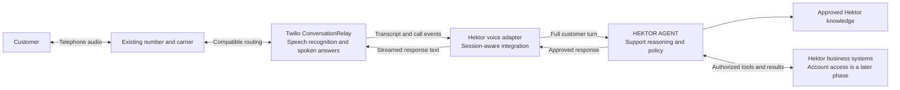
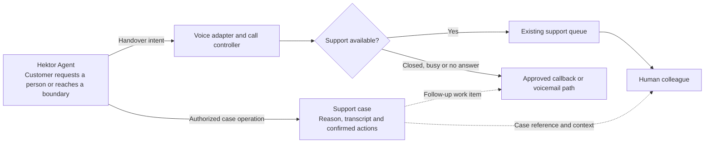
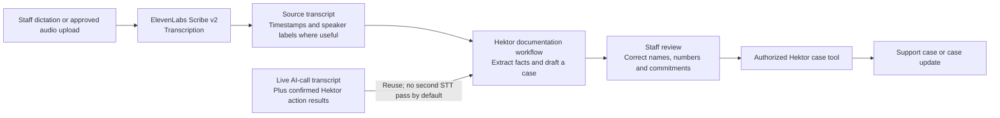

# Voice and dictation: evidence and proposed integration

Research baseline and source check date: **10 September 2026**. This document supports the 20 main slides and six appendix slides. Official pages were opened and relevant capability, pricing and limitation sections checked. Claims below are deliberately narrower than vendor marketing. Recheck mutable documentation, tariffs and supplier terms before procurement.

## Evidence boundary

The inspected project contains a Slidev management proposal and a scripted legacy `mockup/`. Neither establishes a working support backend. No Hektor runtime repository or API documentation was identified in the available project. The intended reuse of an existing harness is supplied context; its full-turn invocation, tools, identity integration, case API, cancellation and durable state remain prerequisites.

**Documented:** providers' speech interfaces, supported configurations and published rates below. **Proposed:** our adapter, full-turn delegation, session reconciliation, authorized tools, case delivery, review workflow and fallback design. **Demonstrated here:** presentation source, rendered diagrams and local build/export checks only. No calls or runtime integration tests were performed. No supplier purchases, number provisioning, production routing changes or publication were authorized by this assignment.

## Source registry and claim mapping

All entries checked 2026-09-10. Slide numbers refer to the extended deck. URLs are the official evidence, not evidence that the combined Hektor integration already works.

| ID | Official source | Claim supported / qualification | Slides |
|---|---|---|---|
| S01 | [README](https://github.com/H-Sami/hektor-chat-pitch/blob/main/README.md), [gap analysis](https://github.com/H-Sami/hektor-chat-pitch/blob/main/docs/gap-analysis.md); local source inspection | Existing 12-slide management narrative and scripted mockup; no verified runtime contract. Extended locally by this work. | 1–9, 25 |
| S02 | [ConversationRelay](https://www.twilio.com/docs/voice/twiml/connect/conversationrelay) | Managed speech recognition/synthesis connects an application over WebSocket; our full-turn adapter is proposed. | 10, 16, 21 |
| S03 | [Voice configuration](https://www.twilio.com/docs/voice/conversationrelay/voice-configuration) | Lists `sv-SE`, Google transcription and an ElevenLabs voice. Pin/test configuration; no Swedish superiority benchmark inferred. | 10, 16 |
| S04 | [WebSocket messages](https://www.twilio.com/docs/voice/conversationrelay/websocket-messages) | Transcript/text tokens, interruption information and end/handoff data; application must reconcile speech and actions. | 12, 21, 23 |
| S05 | [Connect](https://www.twilio.com/docs/voice/twiml/connect) | ConversationRelay regional support includes IE1; action callback returns to call control. No automatic CRM delivery. | 12, 14 |
| S06 | [Infrastructure](https://www.twilio.com/docs/global-infrastructure), [regional feature availability](https://www.twilio.com/docs/global-infrastructure/regional-product-and-feature-availability) | Selected region does not guarantee all data remains there; product coverage varies. | 14, 25 |
| S07 | [Sweden voice pricing](https://www.twilio.com/en-us/voice/pricing/se), [conversational AI pricing](https://www.twilio.com/en-us/products/conversational-ai/pricing) | ConversationRelay $0.07/min; eligible SIP/BYOC incoming $0.004/min; outbound Swedish fixed $0.0187 or mobile $0.0714/min. Route and contract assumptions below. | 15, 24 |
| S08 | [Custom LLM](https://elevenlabs.io/docs/eleven-agents/customization/llm/custom-llm) | Custom OpenAI-compatible streaming endpoint. A wrapper could run the complete Hektor workflow; compatibility is an interface, not an obligation to buy an OpenAI model. | 16, 21–22 |
| S09 | [Native SIP](https://elevenlabs.io/docs/eleven-agents/phone-numbers/sip-trunking) | Existing SIP/PBX connectivity. Combined Hektor endpoint/session/call control must be tested. | 16, 21–22 |
| S10 | [Transfer to number](https://elevenlabs.io/docs/eleven-agents/customization/tools/system-tools/transfer-to-number) | SIP REFER requires acceptance and lacks the native spoken warm-transfer message available in native Twilio integration; staff context is separate. | 16, 21–22 |
| S11 | [Speech Engine / Twilio bridge](https://elevenlabs.io/docs/eleven-agents/phone-numbers/twilio-integration/custom-llm-integration) | Distinct Speech Engine WebSocket plus Twilio Media Streams pattern. Its bridge, pricing and transfer work must be assessed independently. | 16, 22 |
| S12 | [Speech to text](https://elevenlabs.io/docs/overview/capabilities/speech-to-text) | Scribe v2 supports Swedish, timestamps and diarization. Speaker labels are not verified identities. | 13, 21 |
| S13 | [API pricing](https://elevenlabs.io/pricing/api) | Public Scribe batch $0.22/hour plus $0.05/hour keyterm prompting; Speech Engine $0.08/min is a separate product rate. Not an Enterprise or native Agents/SIP quote. | 15, 24 |
| S14 | [Data residency](https://elevenlabs.io/docs/overview/administration/data-residency) | Enterprise feature; default service and isolated EU storage differ. Review processing/support locations and external endpoints separately. | 14, 25 |
| S15 | [Zero Retention Mode](https://elevenlabs.io/docs/eleven-api/resources/zero-retention-mode) | Enterprise, eligible API/configuration-specific controls; not a blanket guarantee about every account artifact or service. | 14, 25 |
| S16 | [Retell LLM WebSocket](https://docs.retellai.com/api-references/llm-websocket) | Custom server receives conversation information and produces responses; full-turn Hektor delegation is possible with an adapter. | 21–22 |
| S17 | [Retell compliance](https://docs.retellai.com/general/compliance) | Documentation currently says services do not operate within the EU. Procurement consideration, not a finding of unlawfulness. | 22 |
| S18 | [Hektor contact and FAQ](https://hektormobil.se/kontakta-oss) | Public WiFi-calling explanation; published staffed hours total 40/week, leaving 128 outside the schedule. No traffic inference. | 2, 4, 11 |
| S19 | [Hektor privacy policy](https://hektormobil.se/integritetspolicy-privat) | Recorded calls/chat may be retained up to 90 days. Existing context, not blanket approval for new processors or mandatory retention of each artifact. | 14, 25 |
| S20 | [EU AI Act](https://eur-lex.europa.eu/eli/reg/2024/1689/oj/eng), [IMY processor agreements](https://www.imy.se/verksamhet/dataskydd/det-har-galler-enligt-gdpr/personuppgiftsansvariga-och-personuppgiftsbitraden/personuppgiftsbitradesavtal/), [Swedish electronic communications law](https://www.riksdagen.se/sv/dokument-och-lagar/dokument/svensk-forfattningssamling/lag-2022482-om-elektronisk-kommunikation_sfs-2022-482/) | Starting points for Hektor review of transparency, processor agreements and applicable telecom duties. No claim of legal sign-off; applicability and effective provisions require review. | 14, 25 |

## Recommendation and alternatives

Our assessment favors ConversationRelay for the first proof of concept because it provides managed speech with a text interface while keeping Hektor responsible for full support turns. This limits new media engineering and permits evaluation before a production supplier commitment. Swedish telephone performance is unmeasured. This is a best-fit starting point among the assessed approaches, not a proven universal optimum.

The adapter is small but **session-aware**, not stateless. It maps calls to Hektor sessions, handles delivery/retry events and reconciles interruptions. Hektor owns durable conversation and action state, knowledge, policy and internal tool execution. Reuse existing service/storage/job mechanisms where suitable. No duplicate customer database, knowledge base, autonomous vendor support LLM, memory or call-summary service is assumed.

The credible alternative is existing SIP-capable PBX → ElevenLabs Agents native SIP → custom streaming Hektor endpoint. It could remove Twilio and simplify the deployment if existing telephony is compatible. Combined turn/session/cancellation and call-control integration remains untested. SIP REFER transfer acceptance and separately delivered case context must be proved. The separate Speech Engine WebSocket + Twilio Media Streams pattern is not interchangeable with this route.

A modular audio/STT/TTS stack creates additional media, endpointing, interruption and operational work; our assessment is that the pilot does not yet justify that ownership. Retell can also delegate complete turns through its custom WebSocket. Its current processing-location statement is a procurement consideration requiring review.

## Full editable architecture blueprints

These are proposed boundaries, not deployed integrations. Main slides simplify labels for readability.

### Diagram A: live telephone support

ConversationRelay manages speech. The adapter supplies no independent support decisions. Initial customer-specific tool access is disabled. Pin and test the supported Swedish model/voice configuration rather than relying on defaults (S02–S03).

### Diagram B: handover and case delivery

Twilio handoff returns data to call control; it does not populate Hektor's case system or staff desktop. Failed case delivery needs durable retry/alerting and must not prevent urgent human connection (S04–S05). The deck's DEMO-001 case is fictional.

### Diagram C: separate dictation and reusable documentation

Single-speaker staff notes generally do not need diarization. Speaker labels do not establish identity; preserve separate channels/known roles when available for multi-party audio. Draft fields: reason for contact, customer request, confirmed facts, steps attempted, actions actually completed, commitments, follow-up owner/date, uncertain fields and source references. A recording's statement is distinct from a confirmed business-system result. A dictated instruction cannot execute an account change.

Reuse the live AI-leg transcript and confirmed actions by default. Re-transcribe retained audio only for an approved quality/review need. Transcribing the subsequent human leg needs a separate approved PBX/recording/transcription integration; it does not follow automatically from the AI transcript.

## Proposed turn/session contract and controls

These names are design requirements, not verified Hektor API fields.

| Boundary | Requirement |
|---|---|
| Input | Call ID, Hektor session ID, unique turn/event ID, Swedish transcript and trusted verification context |
| Output | Speech text, pending-job status, completion/handover intent and optional case reference |
| Full turn | Invoke Hektor's complete support workflow, including its internal tool loop; do not bypass it with a raw model call |
| Authority | Identity and permissions enforced server-side; provider text cannot authorize tools. Validate signed callbacks, prevent replay and restrict transfer destinations |
| Interruptions | Stop queued speech and obsolete response generation; reconcile the spoken prefix with history. Interruption does not undo committed actions |
| Retries | Durable logical action IDs, idempotent case/business writes, reconcile uncertain outcomes before retrying |
| Long work | Acknowledge slow lookups; move long operations to approved follow-up tasks |
| Failures | Hektor outage: approved deterministic response and human/follow-up path. Voice outage: original PBX/carrier fallback. Case outage: durable retry plus alert |
| Monitoring | Separate recognition, Hektor, tool and speech-start delays; failed transfers, missing cases, repeat contacts, review effort, concurrency and actual bills |

Minimize personal data in logs; use correlation IDs rather than copying full transcripts everywhere. An unverified caller can reach a human. Caller ID is not the proposed authentication method. Eventual verified support means an approved identity check, scoped read-only lookup, and supported answer or escalation. Do not assume BankID. Outbound follow-up is a later decision requiring approved purpose, calling windows, retry limits, caller identity and voicemail privacy; it is outside this inbound pilot.

## Data review, not a compliance guarantee

IE1 availability does not make the Twilio/Google/ElevenLabs/Hektor chain EU-only. Review exact products, regional feature coverage, processing/storage, metadata, support access and contracts (S05–S06). ElevenLabs residency is Enterprise; distinguish EU storage, eligible API/Zero Retention configurations, processing and default service behavior. External Hektor endpoints/webhooks must meet the agreed geography too (S14–S15). Public usage rates do not price that configuration.

Audio recording is optional, but transcription still entails personal-data handling. Agree purposes, Hektor-approved disclosure, access controls, retention/deletion by artifact, processors/subprocessors and incident handling. Review GDPR, applicable Swedish telecom rules and AI transparency obligations (S20). The illustrative opening is not an approved privacy/recording script. The existing up-to-90-day policy (S19) is context, not new-vendor approval or a mandatory lifetime for every recording, case and log. Even non-production tests involving personal data need appropriate approval.

## Cost arithmetic and exclusions

Illustrative sizing only: 300 inbound calls × 4 AI minutes = 1,200 AI minutes. 15% transfer rate = 45 calls × 6 human minutes = 270 human minutes. In the illustrated Twilio-bridged route, the inbound leg continues during human conversation: **1,470 inbound minutes**, before extra ringing, queues and holds. Separate staff dictation: 10 hours/month. USD excluding tax.

| Selected component | Calculation | Monthly amount |
|---|---|---:|
| ConversationRelay processing | 1,200 × $0.07 | $84.00 |
| One eligible SIP/BYOC inbound tariff | 1,470 × $0.004 | $5.88 |
| Onward Swedish fixed OR mobile leg | 270 × $0.0187 OR $0.0714 | $5.05–$19.28 |
| Scribe batch with keyterm prompting | 10 × ($0.22 + $0.05) | $2.70 |
| **Selected usage subtotal only** | Sum; rounded to cents | **$97.63–$111.86** |

Not a total budget or production quote. Eligible SIP/BYOC inbound is one tariff, not two cumulative routes. Ordinary forwarding to a new number, a different destination, conference-based warm transfer or SIP staff endpoint changes the arithmetic. Standard managed speech is assumed in ConversationRelay; verify the account tariff. Do not add Media Streams or duplicate STT/TTS charges without a contract requirement.

Excluded: existing carrier/forwarding, number rental where applicable, Hektor model/tool/summarization usage, adapter hosting, storage, optional recordings, monitoring, queue/conference overhead, Enterprise/security commitments, staff review, implementation and ongoing support. Include holds, billing increments and retained-storage accumulation when actual usage is available. No invented SEK conversion, supplier minimum or Swedish-number quote.

Scribe plan allowances and actual bill treatment need confirmation; do not count included usage twice. Speech Engine's $0.08/min public rate does not automatically apply to native ElevenLabs Agents/SIP. Verify that route's plan, inclusions, custom-endpoint treatment, overage and residency requirements separately. Public rates were checked on the baseline date; recheck before agreeing a pilot budget.

## Open information and production gates

| Area | Information needed |
|---|---|
| Runtime | Repository/API access; full turns; streaming; sessions; cancellation; timeouts; concurrency |
| Tools/state | Authorized tool catalogue; case API; idempotency; pending jobs; durable outcomes and audit |
| Identity | Existing verification, assurance needs, read-only scope, human escalation rules; no BankID assumption |
| Telephony | Carrier/PBX; number control; SIP/forwarding; queue destination; transfer acceptance; hours and fallback owner |
| Documentation | Staff-only notes vs whole calls; review UI; case schema; whether human call legs are recorded/transcribed |
| Data/contracts | Required processing/storage/access locations; suppliers; retention; recording/disclosure; Enterprise quotes |
| Operations/economics | Volume/peaks; actual Hektor costs; service owners; support expectations; budget |

Production readiness remains blocked by unresolved runtime interfaces, authentication, reliable handover/case delivery, supplier/data approval and untested Swedish performance. Account-changing actions require a separate authorization and safety review.

## Proposed acceptance suite: not yet performed

After authorization: confirm full-turn interface and non-production design; test Swedish public help; prove human handover and case delivery with reviewed dictation alongside; consider verified read-only customer access only after a separate gate. Keep web-chat source, mobile and keyboard tests.

Propose at least **50 internal end-to-end Swedish telephone calls**, **10–20 matched alternative comparisons** where feasible, and roughly **100 focused utterances**. Cover Hektor terminology, Å/Ä/Ö and other names, phone/customer/invoice numbers, dates, amounts, negations, corrections, regional/non-native accents, fast speech, silence, overlapping speech, speakerphone and noise. Use real telephone-bandwidth audio, not only clean browser microphones.

| Area | Proposed target | Result |
|---|---|---|
| Access boundaries | Zero unauthorized account reads in the defined security suite | Not yet measured |
| Retry safety | Zero duplicate writes in sandbox fault injection | Not yet measured |
| Human handover | 20/20 controlled transfers with usable context; separately test busy, closed and failed case delivery | Not yet measured |
| Critical identifiers | Correctly confirmed or explicitly withheld; never silently guessed | Not yet measured |
| Responsiveness | No-tool end-of-utterance to audible response: p50 <1.2 s and p95 <2.5 s | Not yet measured |
| Interruptions | At least 95% successful scripted barge-in, including history reconciliation | Not yet measured |
| Dictation | At least 95% factual-field accuracy before review; critical numbers/dates checked before saving | Not yet measured |
| Swedish experience | Median tester rating at least 4/5 for intelligibility and naturalness | Not yet measured |
| Failure recovery | Safe routes demonstrated for Hektor, voice layer and case system failures | Not yet measured |

These are project targets to agree, not vendor guarantees or production reliability evidence from a small sample. Define denominators, timing and pass criteria before execution; report actual sample counts and uncertainty.

## Local presentation verification

Completed on 10 September 2026 using Node 22 and installed Google Chrome:

- `npm ci --ignore-scripts`: successful reproducible installation. npm reports eight dependency advisories (3 low, 1 moderate, 4 high); no broad dependency/security upgrade was attempted.
- `npm run build`: successful. Local preview served from `dist/` at `http://127.0.0.1:8099` using the repository's preview server.
- `npm run verify`: all 26 dynamically discovered headings, footer totals, text bounds, Mermaid shadow-DOM diagrams and browser error checks passed. Screenshots are in `.verify-shots/`.
- `npm run export -- --executable-path "C:\Program Files\Google\Chrome\Application\chrome.exe"`: successful. `Hektor-AI-Chat-Pitch.pdf` has 26 pages; all headings match the source and every page is 16:9. The three architecture pages and final appendix were also rendered from the PDF for visual inspection.
- `npm run build:pages`: successful with `/hektor-chat-pitch/` asset URLs. `ghdest/` is local review output, with the PDF and `.nojekyll` staged locally; it has not been published.
- `git diff --check`: passed. No push or deployment was performed.

The stricter browser check exposed an inherited FloatingVue/Twoslash initialization error. A `floating-vue` 5.2.2 override fixes that compatibility issue; `package.json` and the lockfile record it. These checks verify the presentation only. They do not validate Hektor runtime behavior, telephone routing, Swedish speech quality, case delivery or supplier compliance.
