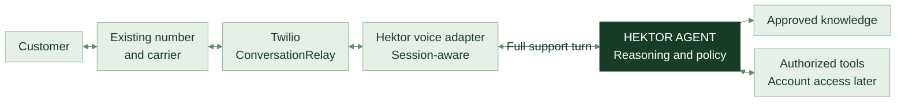
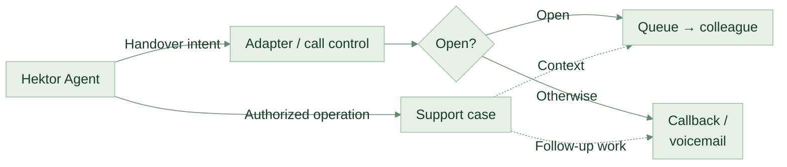
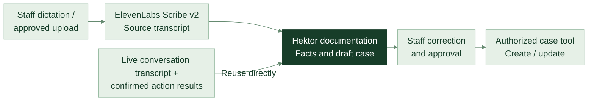

<DeckHeader />

CUSTOMER EXPERIENCE, WITH HEKTOR AT THE CENTRE

# A better first response.

Answers from your knowledge. A clear path to your people.

Web chat, telephone support and staff dictation

THE PROPOSED EXPERIENCE

<DeckIcon name="chat" />“Can you help me with this?”

<DeckIcon name="chat" />

HEKTOR AGENT<strong>Let's find the right answer.</strong>
Grounded in Hektor's approved information.

<DeckIcon name="book" />A useful answer<DeckIcon name="person" />The right colleague

Illustrative concept / not a live service

<DeckFooter :page="1" note="Hektor Agent / A proposal for management" />

<!--
The proposal retains a better first response on Hektor's contact page and extends it to telephone support and separate reviewed staff dictation. Customers should be able to find straightforward answers, and reach Hektor's people with context when they need help. This is a proposed service, not a finished product. Today we are deciding whether a focused pilot is worth scoping.
-->

---

<DeckHeader :chapter="1" />

WHY THIS MATTERS

# Why this matters to your customers.

A better first response for the customer, and less pressure on the team.

<section>01 / ALWAYS OPEN<h2>Answers at any hour.</h2>
Every question gets a first response, day or night. Nobody waits until Monday for something the website already explains.
</section><section>02 / MANY AT ONCE<h2>Every customer served at once.</h2>
Hektor Agent holds as many conversations as they arrive together. The team stops being the queue.
</section><section>03 / THE RIGHT NEXT STEP<h2>Guided, never stranded.</h2>
When a question needs a person, it goes to support or sales with the conversation attached. No dead ends.
</section>

<b>What changes for Hektor:</b> the team keeps the judgement, and stops being the queue.

<DeckFooter :page="2" note="Proposed value of the service / pilot evidence still to be gathered" />

<!--
Lead with value before evidence. Three benefits in the order a customer experiences them: it answers at any hour, it answers everyone at once, and it always offers a next step. Concurrency is the part that changes the picture for a small team: an agent is not limited to one conversation per person, so the first response no longer waits for a free colleague. Say plainly that these are the intended benefits of the design, and that the pilot exists to measure them rather than assert them.
-->

---

<DeckHeader :chapter="1" />

THE OPPORTUNITY

# Help should be easier to find.

Your answers already exist. A conversation makes them easier to reach.

40staffed hours per week

<b>128</b>hours outside the published schedule

Hektor Agent could answer common questions when the team is unavailable.

Forms and email still accept messages. Opening hours do not measure customer demand.

<WeeklyHours />

<DeckFooter :page="3" note="Source: Hektor contact page / weekdays 08:00-17:00, lunch 12:00-13:00 / checked 10 Sep 2026" source="https://hektormobil.se/kontakta-oss" />

<!--
The contact page lists nine hours each weekday with a one-hour lunch closure. That is eight staffed hours a day, forty a week, and 128 hours outside the published hours. The previous deck incorrectly used forty-five. Forms and email can still receive messages outside those hours. We have not measured the volume of questions arriving then, so do not turn this figure into a revenue claim.
-->

---

<DeckHeader :chapter="1" />

THE CUSTOMER JOURNEY

# Every question needs a next step.

One chat on the contact page. Three ways to help.

<DeckIcon name="chat" />
<h2>The customer asks</h2>
A question in their own words.
hektormobil.se/kontakta-oss

<DeckIcon name="arrow" />

<DeckIcon name="chat" />
<h2>Hektor Agent</h2>
Understands the need. Finds the right next step.

<DeckIcon name="book" /><section><h2>Answer</h2>
Explain an approved support topic.
</section>

<DeckIcon name="flag" /><section><h2>Guide</h2>
Prepare an enquiry for sales.
</section>

<DeckIcon name="person" /><section><h2>Connect</h2>
Bring the right person into the case.
</section>

<DeckFooter :page="4" note="Proposed experience / existing phone, email and contact form remain available" />

<!--
These are three different reasons to use the same chat: find information, express an interest, or get help from a person. Existing channels stay available. The pilot should establish which questions are genuinely useful to handle this way. We should confirm that Hektor's website supports the integration before promising an installation approach.
-->

---

<DeckHeader :chapter="2" />

WHAT THE CUSTOMER SEES

# A clear answer. A clear way to a person.

<DeckIcon name="chat" />

<b>Hektor Agent</b>Här för att hjälpa dig
CONCEPT

Hur fungerar WiFi-samtal?

Du ringer via WiFi i stället för mobilnätet. Din telefon behöver stödja tjänsten.<a href="https://hektormobil.se/kontakta-oss"><DeckIcon name="link" />Hektors vanliga frågor 1</a>

<DeckIcon name="person" />Prata med en människa 2

När supporten är stängd kan du lämna en kontaktförfrågan.

1
<h2>Make the answer checkable.</h2>
Show the Hektor page behind the response.

2
<h2>Make the next step obvious.</h2>
A visible route to a person, with clear information about availability.

<DeckIcon name="arrow" />Help without a dead end.

<DeckFooter :page="5" note="Illustrative conversation / WiFi-calling explanation paraphrases Hektor's public FAQ" source="https://hektormobil.se/kontakta-oss" />

<!--
Walk through the Swedish WiFi-calling example. The answer paraphrases Hektor's FAQ. Marker 1 links the response to its source; marker 2 makes the route to a person visible. The handover control shown here is part of a static illustration, not an interactive or live product. The final message explains the out-of-hours path. Staff availability, case delivery and the response promise all need agreement with Hektor.
-->

---

<DeckHeader :chapter="2" />

HOW THE ANSWER IS BUILT

# Your knowledge. Behind every answer.

Start with information Hektor approves and keeps current.

01 / APPROVED SOURCES

<DeckIcon name="book" />FAQ &amp; support guidance

<DeckIcon name="document" />Services &amp; terms

<DeckIcon name="arrow" />

<DeckIcon name="chat" />

02 / HEKTOR AGENT
<h2>Find. Explain. Show the source.</h2>

<DeckIcon name="arrow" />

03 / CUSTOMER RESPONSE
<h2>A useful answer.</h2>
With a source and a next step.

<DeckIcon name="link" />Hektor's own material

<DeckIcon name="person" /><strong>Hektor owns the answers.</strong>A named owner approves sources and resolves conflicts.

<DeckFooter :page="6" note="Initial pilot: approved public information / source citations help review; they do not guarantee accuracy" />

<!--
The first pilot can use public information without connecting customer records. Hektor needs to nominate someone to approve the sources and decide which version is authoritative. Showing a source helps review, but does not guarantee a correct answer. We must test whether each answer is supported by its cited material. Conflicting or missing material should lead to a handover.
-->

---

<DeckHeader :chapter="2" />

CLEAR RESPONSIBILITIES

# The agent explains. Your team decides.

Agree the boundaries before the first customer conversation.

<section class="agent-role">

<DeckIcon name="chat" />
HEKTOR AGENT
<h2>Information &amp; guidance</h2><ul class="check-list"><li><DeckIcon name="check" />Answer approved general questions</li><li><DeckIcon name="check" />Explain services and point to sources</li><li><DeckIcon name="check" />Prepare support or sales requests</li></ul>
A useful first response.
</section>
<section class="human-role">

<DeckIcon name="person" />
YOUR TEAM
<h2>Judgement &amp; commitments</h2><ul class="check-list"><li><DeckIcon name="check" />Prices, refunds and payment terms</li><li><DeckIcon name="check" />Account changes and cancellations</li><li><DeckIcon name="check" />Uncertain or sensitive cases</li></ul>
A person makes the decision.
</section>

<DeckFooter :page="7" note="Proposed operating rules / no account-changing tools in the initial pilot" />

<!--
These are proposed operating rules, not a claim that a language model can never make a mistake. The first pilot should not have tools that can alter accounts or take commercial actions. Test the agent with missing information, conflicting sources, pressure to invent a price and requests outside scope. Review failures with Hektor before exposing it to customers.
-->

---

<DeckHeader :chapter="2" />

WHAT YOUR TEAM RECEIVES

# A handover with the context attached.

The next colleague should not have to start the conversation again.

<DeckIcon name="chat" />
<h2>A customer needs a person.</h2>
The customer asks, or the agent reaches a boundary.

<DeckIcon name="document" />
<h2>A useful case is prepared.</h2>
The question, what was tried and the relevant conversation.

<DeckIcon name="person" />
<h2>The right team follows up.</h2>
Through the agreed support or sales channel.

<DeckIcon name="document" />SUPPORT HANDOVERExample

<h2>Help with WiFi calling</h2>
<dl><dt>Reason</dt><dd>Customer asked for a person</dd><dt>Already covered</dt><dd>General explanation and FAQ link</dd><dt>Attached</dt><dd>Relevant conversation and summary</dd></dl>

<DeckIcon name="arrow" />
<b>Next step</b>Support follows up through the agreed channel.

<DeckFooter :page="8" note="Follow-up ownership, destination and response promise to be agreed with Hektor" />

<!--
The handover is part of the product, not an exception. It needs an owner, a destination and an agreed response promise. A summary should be distinguishable from the actual transcript so staff can check it. Collect only appropriate contact information, explain its purpose and confirm that cases reach the agreed destination. Do not promise an immediate human response when the team is unavailable.
-->

---

<DeckHeader :chapter="2" />

A DELIBERATE STARTING POINT

# General answers first. Personal support later.

Prove the experience before connecting customer records.

<section class="phase-now">
INITIAL PILOT
<h2>Public knowledge.</h2>
Approved FAQs, services and support guidance.

<DeckIcon name="book" />Useful without customer-record access.
</section>

<DeckIcon name="arrow" />Separate decision

<section class="phase-later">
<DeckIcon name="lock" />POSSIBLE NEXT PHASE
<h2>Personal support.</h2>
Relevant customer information, after an approved identity check.

Verify identityLimit accessAgree retention
</section>

<DeckIcon name="shield" />Even a general chat can receive personal information. Agree its handling before launch.

<DeckFooter :page="9" note="Customer-system feasibility and privacy requirements need review before any later integration" />

<!--
We do not yet know Hektor's CRM or identity setup. The initial pilot does not need customer-record access. A later phase needs a technical and privacy review, including supplier terms, data flows, access controls and retention. Even a public-information chat can receive personal information typed by users, so the pilot still needs an appropriate collection and handling policy. These are design decisions to review, not a legal compliance guarantee.
-->

---

<DeckHeader :chapter="3" />

PROPOSED EXTENSION

# One Hektor Agent. More ways to get help.

Shared knowledge and rules. Three distinct interaction workflows.

<section>01 / WEBSITE CHAT<h2>Type a question.</h2>
Public answers and an agreed route to a colleague. The original pilot experience.
</section><section>02 / CUSTOMER PHONE<h2>Talk in Swedish.</h2>
A managed speech interface carries the conversation to Hektor. Human help stays available.
</section><section>03 / STAFF DICTATION<h2>Speak a case note.</h2>
Transcribe, draft and review. An authorized case operation follows staff approval.
</section>

<b>HEKTOR AGENT</b> owns support reasoning, policy and authorized actions in the proposed design.

<DeckFooter :page="10" note="Proposed integration / Hektor runtime interfaces not yet verified" />

<!--
Extend the original public-information-first proposal across channels. The user intends to reuse an existing Hektor harness; no runtime repository or verified API contract was available in this presentation project. Knowledge retrieval, full-turn execution, tools, identity and case APIs are prerequisites to inspect, not functionality demonstrated by the slides. Dictation is a separate staff documentation workflow, not an autonomous customer telephone agent.
-->

---

<DeckHeader :chapter="3" />

PROPOSED EXTENSION

# Add a voice, not another support brain.

The preferred first proof of concept keeps Hektor authoritative.

Twilio speech: Swedish Google transcription + ElevenLabs voice. Adapter: transcript in, speech text out.

<DeckFooter :page="11" note="S02-S03 / Documented speech interface; proposed Hektor integration" />

<!--
Proposed architecture, not deployed. S02 documents the managed WebSocket speech interface. S03 lists sv-SE with Google transcription and an ElevenLabs voice; this proves configuration availability, not superior Swedish telephone quality. Pin and test provider, model and voice instead of trusting changing defaults. The small adapter delegates complete support turns to Hektor, including knowledge, policy and internal tool loops. It supplies no independent support decisions. It is session-aware: call/session mappings, delivery events, retries and interruption reconciliation. Hektor remains durable authority for conversation and action state. Customer-specific tools are disabled in the initial pilot. Reuse existing service/storage/job mechanisms; no duplicate knowledge base, customer database, vendor LLM, memory or orchestration platform by default. Full Diagram A is retained in docs/voice-dictation-research.md. Sources S02 https://www.twilio.com/docs/voice/twiml/connect/conversationrelay ; S03 https://www.twilio.com/docs/voice/conversationrelay/voice-configuration
-->

---

<DeckHeader :chapter="3" />

PROPOSED EXTENSION

# A Swedish call, from question to next step.

ILLUSTRATIVE PILOT CONVERSATION

<b>Hektor</b>
Hej! Du pratar med Hektor Agent. Jag kan hjälpa dig med vanliga frågor eller hjälpa dig att nå supporten.

<b>Customer</b>
Hur fungerar wifi-samtal?

<b>Hektor</b>
Du ringer via wifi i stället för mobilnätet. Din telefon behöver stödja tjänsten.

<b>Customer</b>
Kan du kontrollera mitt abonnemang?

<b>Hektor</b>
Jag kan inte se dina abonnemangsuppgifter här. Jag hjälper dig vidare till supporten.

Proposed next step: connect to support and deliver the context separately.

<DeckFooter :page="12" note="S18 / Public FAQ; dialogue and next steps are illustrative" />

<!--
The Swedish general answer paraphrases the public FAQ, S18 https://hektormobil.se/kontakta-oss . No live call, account lookup, identity verification or subscription change is demonstrated. The initial pilot cannot access account records. Eventual personal support requires an approved identity check, scoped read-only lookup and a supported answer or escalation. Caller ID alone is not authentication; an unverified caller can still reach a person. Do not assume BankID. The opening illustrates how the agent introduces itself, not a complete approved privacy or recording script. Hektor must approve disclosure and personal-data handling before applicable testing.
-->

---

<DeckHeader :chapter="3" />

PROPOSED EXTENSION

# The next colleague receives the context.

<section class="compact-case">ILLUSTRATIVE / CASE DEMO-001<h2>WiFi calling → account help</h2><dl><dt>Request</dt><dd>Check subscription</dd><dt>Verification</dt><dd>Not verified</dd><dt>Covered</dt><dd>Public WiFi explanation</dd><dt>Tool outcomes</dt><dd>No account action</dd><dt>Escalation</dt><dd>Account access boundary</dd><dt>Next owner</dt><dd>Support queue / agreed follow-up</dd></dl></section>

Transfer and case delivery are separate. Open → queue; busy, closed or no answer → approved follow-up.

<DeckFooter :page="13" note="S04-S05 / Call control is documented; case delivery is proposed" />

<!--
Diagram B describes proposed handover. Twilio end/handoffData can return control and information to the Connect action callback; it does not populate a CRM or staff desktop. Case creation, context routing and delivery acknowledgment need Hektor-owned integration. Include reason, relevant transcript and confirmed actions. Fictional identifier DEMO-001. Open support routes to the queue; busy, closed and no-answer routes need approved callback/voicemail handling. Failed case delivery needs durable retry and an operator alert; it must not prevent an urgent human connection. Full blueprint is retained in the research document. Sources S04 https://www.twilio.com/docs/voice/conversationrelay/websocket-messages ; S05 https://www.twilio.com/docs/voice/twiml/connect
-->

---

<DeckHeader :chapter="3" />

PROPOSED EXTENSION

# Dictate once. Review before saving.

Staff dictation is separate from the live customer conversation.

<b>Draft fields</b>Reason &amp; request · confirmed facts · steps tried · completed actions · commitments Follow-up owner/date · uncertain fields · source transcript references

<DeckFooter :page="14" note="S12 / Documented transcription features; proposed review and case workflow" />

<!--
Proposed documentation workflow, Diagram C. S12 documents Swedish, timestamps and speaker diarization for Scribe v2. Speaker labels do not establish identity; single-speaker staff notes usually need no diarization. Preserve separate channels/known roles where available for multi-party audio. Retain source references, distinguish reported statements from confirmed business-system results and mark uncertainty. Review names, critical numbers, dates and commitments before an authorized case write. A dictated instruction must never directly execute an account change. Reuse live AI transcripts and confirmed Hektor actions; no second transcription service by default. Re-transcribe retained audio only for a justified approved review requirement. The live transcript covers the AI leg only. The subsequent human conversation needs a separately approved PBX/recording/transcription integration. Source S12 https://elevenlabs.io/docs/overview/capabilities/speech-to-text
-->

---

<DeckHeader :chapter="3" />

PROPOSED EXTENSION

# Access and actions stay under Hektor’s control.

Three boundaries must hold across chat, phone and documentation.

<section>01 / VERIFY<h2>Before account access.</h2>
An approved identity check precedes a scoped lookup. Caller ID is insufficient.
</section><section>02 / AUTHORIZE<h2>Permissions on the server.</h2>
Hektor controls tools and confirmed actions. Speech or dictated text cannot grant access.
</section><section>03 / RECOVER<h2>A safe route to a person.</h2>
Handle interruptions, outages and failed case delivery. Human access does not require verification.
</section>

<b>Data review required.</b> IE1 does not establish an EU-only chain; ElevenLabs residency requires an eligible Enterprise setup.

<DeckFooter :page="15" note="S05-S06, S14-S15, S19-S20 / Target controls; supplier and privacy review required" />

<!--
Target design, not a compliance guarantee. Validate signed callbacks, prevent replay and restrict transfer destinations. Voice-provider text must not set trusted authorization. Interruption stops queued speech and obsolete generation; reconcile what was actually spoken with Hektor history. It does not undo a committed action. Persist logical action IDs and reconcile uncertain outcomes before retrying idempotent writes. Hektor outages use approved deterministic messages and human/follow-up routes, not a replacement autonomous support LLM. Full voice outage needs original carrier/PBX fallback. Case failures require durable retry/alerting. S05-S06: IE1 availability does not guarantee all data remains there; check each product, speech processor, metadata and support access. S14-S15: ElevenLabs residency and eligible Zero Retention configurations are Enterprise features; EU storage, processing and external endpoints must be reviewed separately. Recording is optional; transcription still handles personal data. Agree purpose, disclosure, access, retention/deletion, processors/subprocessors and incident response under GDPR, applicable Swedish telecom rules and AI transparency obligations (S20), without claiming legal approval. Hektor’s up-to-90-day recorded-call/chat policy is context, not authorization for new vendors or every artifact (S19). Any personal-data test needs appropriate approval. Full URLs and qualification mapping are in docs/voice-dictation-research.md.
-->

---

<DeckHeader :chapter="3" />

TWO WAYS TO ADD THE PHONE

# Two ways to add the phone.

<section class="preferred">PREFERRED STARTING POINT<h2>Use a managed voice service</h2>
The speaking and listening is handled by a specialist service. Hektor Agent still writes every answer and makes every decision.
<ul><li>Fastest route to a working Swedish phone line</li><li>Hektor stays the authority on every answer</li><li>Proven call handling and transfer to a person</li></ul></section><section>ALTERNATIVE, IF IT FITS BETTER<h2>Use Hektor's own phone system</h2>
The same Hektor Agent, reached directly through the telephone system Hektor already has. Nothing is added to the route.
<ul><li>Reuses your existing telephone setup</li><li>One less supplier to manage</li><li>Depends on what your phone system supports</li></ul></section>

We recommend the first. The choice is confirmed after a short Swedish telephone test, and no decision is needed today.

<DeckFooter :page="16" note="Both routes use the same Hektor Agent and the same approved knowledge" />

<!--
Keep this high level. Both routes put Hektor Agent in charge of the answer; they differ only in who provides the voice. The first is the recommended starting point because the speech side is managed for us. The second is worth considering only if Hektor's own telephone system already supports it. Say that the final choice is a short technical test, not a decision the room has to make today, and do not go into supplier names or protocols here.
-->

---

<DeckHeader :chapter="4" />

THANK YOU

# Thank you.

We would welcome the chance to run a measured pilot with you.

01<b>Give us a scope: the web chat, the phone line, or both.</b>

02<b>Name one person at Hektor who owns the answers.</b>

03<b>Tell us what a good result would look like to you.</b>

<DeckFooter :page="17" note="Thank you / questions welcome" />

<!--
End on gratitude and one small ask. Thank the room for the time, then recap in a single sentence: a better first response for the customer, and less pressure on the team. The three items are deliberately small and non-technical. Do not reintroduce cost, timelines or testing detail here; if asked, say the next step is a short technical conversation, not a commitment.
-->
