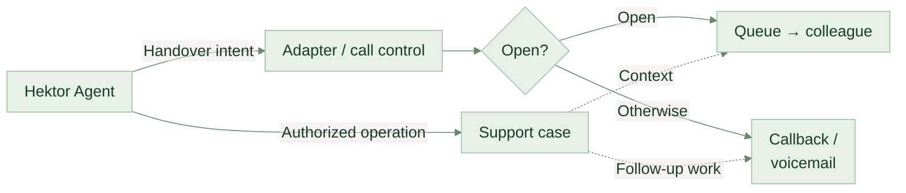
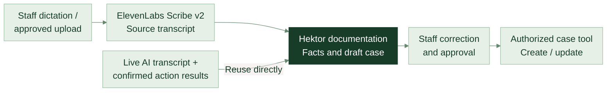

<DeckHeader />

CUSTOMER EXPERIENCE, WITH HEKTOR AT THE CENTRE

# A better first response.

Answers from your knowledge. A clear path to your people.

Web chat, telephone support and staff dictation

THE PROPOSED EXPERIENCE

<DeckIcon name="chat" />“Can you help me with this?”

<DeckIcon name="chat" />

HEKTOR AGENT<strong>Let's find the right answer.</strong>
Grounded in Hektor's approved information.

<DeckIcon name="book" />A useful answer<DeckIcon name="person" />The right colleague

Illustrative concept / not a live service

<DeckFooter :page="1" note="Hektor Agent / A proposal for management" />

<!--
The proposal retains a better first response on Hektor's contact page and extends it to telephone support and separate reviewed staff dictation. Customers should be able to find straightforward answers, and reach Hektor's people with context when they need help. This is a proposed service, not a finished product. Today we are deciding whether a focused pilot is worth scoping.
-->

---

<DeckHeader :chapter="1" />

THE OPPORTUNITY

# Help should be easier to find.

Your answers already exist. A conversation makes them easier to reach.

40staffed hours per week

<b>128</b>hours outside the published schedule

Hektor Agent could answer common questions when the team is unavailable.

Forms and email still accept messages. Opening hours do not measure customer demand.

<WeeklyHours />

<DeckFooter :page="2" note="Source: Hektor contact page / weekdays 08:00-17:00, lunch 12:00-13:00 / checked 10 Sep 2026" source="https://hektormobil.se/kontakta-oss" />

<!--
The contact page lists nine hours each weekday with a one-hour lunch closure. That is eight staffed hours a day, forty a week, and 128 hours outside the published hours. The previous deck incorrectly used forty-five. Forms and email can still receive messages outside those hours. We have not measured the volume of questions arriving then, so do not turn this figure into a revenue claim.
-->

---

<DeckHeader :chapter="1" />

THE CUSTOMER JOURNEY

# Every question needs a next step.

One chat on the contact page. Three ways to help.

<DeckIcon name="chat" />
<h2>The customer asks</h2>
A question in their own words.
hektormobil.se/kontakta-oss

<DeckIcon name="arrow" />

<DeckIcon name="chat" />
<h2>Hektor Agent</h2>
Understands the need. Finds the right next step.

<DeckIcon name="book" /><section><h2>Answer</h2>
Explain an approved support topic.
</section>

<DeckIcon name="flag" /><section><h2>Guide</h2>
Prepare an enquiry for sales.
</section>

<DeckIcon name="person" /><section><h2>Connect</h2>
Bring the right person into the case.
</section>

<DeckFooter :page="3" note="Proposed experience / existing phone, email and contact form remain available" />

<!--
These are three different reasons to use the same chat: find information, express an interest, or get help from a person. Existing channels stay available. The pilot should establish which questions are genuinely useful to handle this way. We should confirm that Hektor's website supports the integration before promising an installation approach.
-->

---

<DeckHeader :chapter="2" />

WHAT THE CUSTOMER SEES

# A clear answer. A clear way to a person.

<DeckIcon name="chat" />

<b>Hektor Agent</b>Här för att hjälpa dig
CONCEPT

Hur fungerar WiFi-samtal?

Du ringer via WiFi i stället för mobilnätet. Din telefon behöver stödja tjänsten.<a href="https://hektormobil.se/kontakta-oss"><DeckIcon name="link" />Hektors vanliga frågor 1</a>

<DeckIcon name="person" />Prata med en människa 2

När supporten är stängd kan du lämna en kontaktförfrågan.

1
<h2>Make the answer checkable.</h2>
Show the Hektor page behind the response.

2
<h2>Make the next step obvious.</h2>
A visible route to a person, with clear information about availability.

<DeckIcon name="arrow" />Help without a dead end.

<DeckFooter :page="4" note="Illustrative conversation / WiFi-calling explanation paraphrases Hektor's public FAQ" source="https://hektormobil.se/kontakta-oss" />

<!--
Walk through the Swedish WiFi-calling example. The answer paraphrases Hektor's FAQ. Marker 1 links the response to its source; marker 2 makes the route to a person visible. The handover control shown here is part of a static illustration, not an interactive or live product. The final message explains the out-of-hours path. Staff availability, case delivery and the response promise all need agreement with Hektor.
-->

---

<DeckHeader :chapter="2" />

HOW THE ANSWER IS BUILT

# Your knowledge. Behind every answer.

Start with information Hektor approves and keeps current.

01 / APPROVED SOURCES

<DeckIcon name="book" />FAQ &amp; support guidance

<DeckIcon name="document" />Services &amp; terms

<DeckIcon name="arrow" />

<DeckIcon name="chat" />

02 / HEKTOR AGENT
<h2>Find. Explain. Show the source.</h2>

<DeckIcon name="arrow" />

03 / CUSTOMER RESPONSE
<h2>A useful answer.</h2>
With a source and a next step.

<DeckIcon name="link" />Hektor's own material

<DeckIcon name="person" /><strong>Hektor owns the answers.</strong>A named owner approves sources and resolves conflicts.

<DeckFooter :page="5" note="Initial pilot: approved public information / source citations help review; they do not guarantee accuracy" />

<!--
The first pilot can use public information without connecting customer records. Hektor needs to nominate someone to approve the sources and decide which version is authoritative. Showing a source helps review, but does not guarantee a correct answer. We must test whether each answer is supported by its cited material. Conflicting or missing material should lead to a handover.
-->

---

<DeckHeader :chapter="2" />

CLEAR RESPONSIBILITIES

# The agent explains. Your team decides.

Agree the boundaries before the first customer conversation.

<section class="agent-role">

<DeckIcon name="chat" />
HEKTOR AGENT
<h2>Information &amp; guidance</h2><ul class="check-list"><li><DeckIcon name="check" />Answer approved general questions</li><li><DeckIcon name="check" />Explain services and point to sources</li><li><DeckIcon name="check" />Prepare support or sales requests</li></ul>
A useful first response.
</section>
<section class="human-role">

<DeckIcon name="person" />
YOUR TEAM
<h2>Judgement &amp; commitments</h2><ul class="check-list"><li><DeckIcon name="check" />Prices, refunds and payment terms</li><li><DeckIcon name="check" />Account changes and cancellations</li><li><DeckIcon name="check" />Uncertain or sensitive cases</li></ul>
A person makes the decision.
</section>

<DeckFooter :page="6" note="Proposed operating rules / no account-changing tools in the initial pilot" />

<!--
These are proposed operating rules, not a claim that a language model can never make a mistake. The first pilot should not have tools that can alter accounts or take commercial actions. Test the agent with missing information, conflicting sources, pressure to invent a price and requests outside scope. Review failures with Hektor before exposing it to customers.
-->

---

<DeckHeader :chapter="2" />

WHAT YOUR TEAM RECEIVES

# A handover with the context attached.

The next colleague should not have to start the conversation again.

<DeckIcon name="chat" />
<h2>A customer needs a person.</h2>
The customer asks, or the agent reaches a boundary.

<DeckIcon name="document" />
<h2>A useful case is prepared.</h2>
The question, what was tried and the relevant conversation.

<DeckIcon name="person" />
<h2>The right team follows up.</h2>
Through the agreed support or sales channel.

<DeckIcon name="document" />SUPPORT HANDOVERExample

<h2>Help with WiFi calling</h2>
<dl><dt>Reason</dt><dd>Customer asked for a person</dd><dt>Already covered</dt><dd>General explanation and FAQ link</dd><dt>Attached</dt><dd>Relevant conversation and summary</dd></dl>

<DeckIcon name="arrow" />
<b>Next step</b>Support follows up through the agreed channel.

<DeckFooter :page="7" note="Follow-up ownership, destination and response promise to be agreed with Hektor" />

<!--
The handover is part of the product, not an exception. It needs an owner, a destination and an agreed response promise. A summary should be distinguishable from the actual transcript so staff can check it. Collect only appropriate contact information, explain its purpose and confirm that cases reach the agreed destination. Do not promise an immediate human response when the team is unavailable.
-->

---

<DeckHeader :chapter="2" />

A DELIBERATE STARTING POINT

# General answers first. Personal support later.

Prove the experience before connecting customer records.

<section class="phase-now">
INITIAL PILOT
<h2>Public knowledge.</h2>
Approved FAQs, services and support guidance.

<DeckIcon name="book" />Useful without customer-record access.
</section>

<DeckIcon name="arrow" />Separate decision

<section class="phase-later">
<DeckIcon name="lock" />POSSIBLE NEXT PHASE
<h2>Personal support.</h2>
Relevant customer information, after an approved identity check.

Verify identityLimit accessAgree retention
</section>

<DeckIcon name="shield" />Even a general chat can receive personal information. Agree its handling before launch.

<DeckFooter :page="8" note="Customer-system feasibility and privacy requirements need review before any later integration" />

<!--
We do not yet know Hektor's CRM or identity setup. The initial pilot does not need customer-record access. A later phase needs a technical and privacy review, including supplier terms, data flows, access controls and retention. Even a public-information chat can receive personal information typed by users, so the pilot still needs an appropriate collection and handling policy. These are design decisions to review, not a legal compliance guarantee.
-->

---

<DeckHeader :chapter="3" />

PROPOSED EXTENSION

# One Hektor Agent. More ways to get help.

Shared knowledge and rules. Three distinct interaction workflows.

<section>01 / WEBSITE CHAT<h2>Type a question.</h2>
Public answers and an agreed route to a colleague. The original pilot experience.
</section><section>02 / CUSTOMER PHONE<h2>Talk in Swedish.</h2>
A managed speech interface carries the conversation to Hektor. Human help stays available.
</section><section>03 / STAFF DICTATION<h2>Speak a case note.</h2>
Transcribe, draft and review. An authorized case operation follows staff approval.
</section>

<b>HEKTOR AGENT</b> owns support reasoning, policy and authorized actions in the proposed design.

<DeckFooter :page="9" note="Proposed integration / Hektor runtime interfaces not yet verified" />

<!--
Extend the original public-information-first proposal across channels. The user intends to reuse an existing Hektor harness; no runtime repository or verified API contract was available in this presentation project. Knowledge retrieval, full-turn execution, tools, identity and case APIs are prerequisites to inspect, not functionality demonstrated by the slides. Dictation is a separate staff documentation workflow, not an autonomous customer telephone agent.
-->

---

<DeckHeader :chapter="3" />

PROPOSED EXTENSION

# Add a voice, not another support brain.

The preferred first proof of concept keeps Hektor authoritative.

Twilio speech: Swedish Google transcription + ElevenLabs voice. Adapter: transcript in, speech text out.

<DeckFooter :page="10" note="S02–S03 / Documented speech interface; proposed Hektor integration" />

<!--
Proposed architecture, not deployed. S02 documents the managed WebSocket speech interface. S03 lists sv-SE with Google transcription and an ElevenLabs voice; this proves configuration availability, not superior Swedish telephone quality. Pin and test provider, model and voice instead of trusting changing defaults. The small adapter delegates complete support turns to Hektor, including knowledge, policy and internal tool loops. It supplies no independent support decisions. It is session-aware: call/session mappings, delivery events, retries and interruption reconciliation. Hektor remains durable authority for conversation and action state. Customer-specific tools are disabled in the initial pilot. Reuse existing service/storage/job mechanisms; no duplicate knowledge base, customer database, vendor LLM, memory or orchestration platform by default. Full Diagram A is retained in docs/voice-dictation-research.md. Sources S02 https://www.twilio.com/docs/voice/twiml/connect/conversationrelay ; S03 https://www.twilio.com/docs/voice/conversationrelay/voice-configuration
-->

---

<DeckHeader :chapter="3" />

PROPOSED EXTENSION

# A Swedish call, from question to next step.

ILLUSTRATIVE PILOT CONVERSATION

<b>Hektor</b>
Hej! Du pratar med Hektors AI-assistent. Jag kan hjälpa dig med vanliga frågor eller hjälpa dig att nå supporten.

<b>Customer</b>
Hur fungerar wifi-samtal?

<b>Hektor</b>
Du ringer via wifi i stället för mobilnätet. Din telefon behöver stödja tjänsten.

<b>Customer</b>
Kan du kontrollera mitt abonnemang?

<b>Hektor</b>
Jag kan inte se dina abonnemangsuppgifter här. Jag hjälper dig vidare till supporten.

Proposed next step: connect to support and deliver the context separately.

<DeckFooter :page="11" note="S18 / Public FAQ; dialogue and next steps are illustrative" />

<!--
The Swedish general answer paraphrases the public FAQ, S18 https://hektormobil.se/kontakta-oss . No live call, account lookup, identity verification or subscription change is demonstrated. The initial pilot cannot access account records. Eventual personal support requires an approved identity check, scoped read-only lookup and a supported answer or escalation. Caller ID alone is not authentication; an unverified caller can still reach a person. Do not assume BankID. The opening illustrates AI identification, not a complete approved privacy or recording script. Hektor must approve disclosure and personal-data handling before applicable testing.
-->

---

<DeckHeader :chapter="3" />

PROPOSED EXTENSION

# The next colleague receives the context.

<section class="compact-case">ILLUSTRATIVE / CASE DEMO-001<h2>WiFi calling → account help</h2><dl><dt>Request</dt><dd>Check subscription</dd><dt>Verification</dt><dd>Not verified</dd><dt>Covered</dt><dd>Public WiFi explanation</dd><dt>Tool outcomes</dt><dd>No account action</dd><dt>Escalation</dt><dd>Account access boundary</dd><dt>Next owner</dt><dd>Support queue / agreed follow-up</dd></dl></section>

Transfer and case delivery are separate. Open → queue; busy, closed or no answer → approved follow-up.

<DeckFooter :page="12" note="S04–S05 / Call control is documented; case delivery is proposed" />

<!--
Diagram B describes proposed handover. Twilio end/handoffData can return control and information to the Connect action callback; it does not populate a CRM or staff desktop. Case creation, context routing and delivery acknowledgment need Hektor-owned integration. Include reason, relevant transcript and confirmed actions. Fictional identifier DEMO-001. Open support routes to the queue; busy, closed and no-answer routes need approved callback/voicemail handling. Failed case delivery needs durable retry and an operator alert; it must not prevent an urgent human connection. Full blueprint is retained in the research document. Sources S04 https://www.twilio.com/docs/voice/conversationrelay/websocket-messages ; S05 https://www.twilio.com/docs/voice/twiml/connect
-->

---

<DeckHeader :chapter="3" />

PROPOSED EXTENSION

# Dictate once. Review before saving.

Staff dictation is separate from the live AI conversation.

<b>Draft fields</b>Reason &amp; request · confirmed facts · steps tried · completed actions · commitments Follow-up owner/date · uncertain fields · source transcript references

<DeckFooter :page="13" note="S12 / Documented transcription features; proposed review and case workflow" />

<!--
Proposed documentation workflow, Diagram C. S12 documents Swedish, timestamps and speaker diarization for Scribe v2. Speaker labels do not establish identity; single-speaker staff notes usually need no diarization. Preserve separate channels/known roles where available for multi-party audio. Retain source references, distinguish reported statements from confirmed business-system results and mark uncertainty. Review names, critical numbers, dates and commitments before an authorized case write. A dictated instruction must never directly execute an account change. Reuse live AI transcripts and confirmed Hektor actions; no second transcription service by default. Re-transcribe retained audio only for a justified approved review requirement. The live transcript covers the AI leg only. The subsequent human conversation needs a separately approved PBX/recording/transcription integration. Source S12 https://elevenlabs.io/docs/overview/capabilities/speech-to-text
-->

---

<DeckHeader :chapter="3" />

PROPOSED EXTENSION

# Access and actions stay under Hektor’s control.

Three boundaries must hold across chat, phone and documentation.

<section>01 / VERIFY<h2>Before account access.</h2>
An approved identity check precedes a scoped lookup. Caller ID is insufficient.
</section><section>02 / AUTHORIZE<h2>Permissions on the server.</h2>
Hektor controls tools and confirmed actions. Speech or dictated text cannot grant access.
</section><section>03 / RECOVER<h2>A safe route to a person.</h2>
Handle interruptions, outages and failed case delivery. Human access does not require verification.
</section>

<b>Data review required.</b> IE1 does not establish an EU-only chain; ElevenLabs residency requires an eligible Enterprise setup.

<DeckFooter :page="14" note="S05–S06, S14–S15, S19–S20 / Target controls; supplier and privacy review required" />

<!--
Target design, not a compliance guarantee. Validate signed callbacks, prevent replay and restrict transfer destinations. Voice-provider text must not set trusted authorization. Interruption stops queued speech and obsolete generation; reconcile what was actually spoken with Hektor history. It does not undo a committed action. Persist logical action IDs and reconcile uncertain outcomes before retrying idempotent writes. Hektor outages use approved deterministic messages and human/follow-up routes, not a replacement autonomous support LLM. Full voice outage needs original carrier/PBX fallback. Case failures require durable retry/alerting. S05–S06: IE1 availability does not guarantee all data remains there; check each product, speech processor, metadata and support access. S14–S15: ElevenLabs residency and eligible Zero Retention configurations are Enterprise features; EU storage, processing and external endpoints must be reviewed separately. Recording is optional; transcription still handles personal data. Agree purpose, disclosure, access, retention/deletion, processors/subprocessors and incident response under GDPR, applicable Swedish telecom rules and AI transparency obligations (S20), without claiming legal approval. Hektor’s up-to-90-day recorded-call/chat policy is context, not authorization for new vendors or every artifact (S19). Any personal-data test needs appropriate approval. Full URLs and qualification mapping are in docs/voice-dictation-research.md.
-->

---

<DeckHeader :chapter="3" />

PROPOSED EXTENSION

# A small pilot, with visible cost assumptions.

Illustrative sizing, not measured Hektor traffic.

CONVERSATIONRELAY PROCESSING ONLY
$84/ month

300 inbound calls × 4 AI minutes × $0.07

<section><h2>Usage is measurable.</h2>
Also assume 45 transfers × 6 human minutes and 10 hours of separate staff dictation.

<b>Total operating cost and implementation scope remain to be agreed.</b>
</section>

This is not the total operating cost. Full selected-component arithmetic and exclusions: Appendix C.

<DeckFooter :page="15" note="S07, S13 / USD excluding tax / public rates checked 10 Sep 2026" />

<!--
USD excluding tax; public rates checked 10 September 2026. These are sizing assumptions, not traffic evidence or a production quote. 300×4=1,200 AI minutes. At 15% transfers, 45×6=270 human minutes. In the illustrated bridged route, inbound minutes continue during human conversation: 1,470 before queue/ringing. Eligible SIP/BYOC tariff and onward destination must be verified. Managed speech is assumed in the ConversationRelay processing component; verify the actual account tariff and do not add duplicate Media Streams or Google/ElevenLabs speech charges without a contract requirement. Appendix C shows selected usage only and exclusions. S07 https://www.twilio.com/en-us/products/conversational-ai/pricing ; https://www.twilio.com/en-us/voice/pricing/se ; S13 https://elevenlabs.io/pricing/api
-->

---

<DeckHeader :chapter="3" />

PROPOSED EXTENSION

# Start simple. Keep the alternative testable.

<section class="preferred">PREFERRED FIRST PROOF OF CONCEPT<h2>Twilio text interface</h2>
Existing carrier → ConversationRelay → session-aware adapter → Hektor.
<ul><li>Managed speech with a documented Swedish configuration</li><li>Hektor owns the full support turn</li><li>Validate routing, interruptions and transfer</li></ul></section><section>CONDITIONAL ALTERNATIVE<h2>ElevenLabs native SIP</h2>
Compatible PBX → ElevenLabs Agents → custom streaming Hektor endpoint.
<ul><li>Could remove Twilio from the route</li><li>Full turns through an OpenAI-compatible interface</li><li>SIP REFER: context delivered separately</li></ul></section>

Choose after Swedish telephone tests, existing-system checks and supplier review.

<DeckFooter :page="16" note="S02–S03, S08–S11 / Supplier capabilities documented; combined integrations untested" />

<!--
Best-fit starting point among assessed routes, not a universal optimum. S08–S09 document native SIP and custom OpenAI-compatible streaming endpoints. A custom endpoint can wrap Hektor’s full support turn; compatible describes an interface and does not require buying another OpenAI model. Combined session lifecycle, interruptions and call control still need testing. This route may be simpler when the current SIP/PBX setup is compatible. S10: native SIP REFER lacks the spoken warm-transfer agent message available with native Twilio integration; verify PBX transfer acceptance and deliver case context separately. Do not conflate native Agents/SIP with S11 Speech Engine WebSocket plus Twilio Media Streams, which has its own bridge, transfer and pricing responsibilities. Appendix A compares modular media and Retell. Sources S08 https://elevenlabs.io/docs/eleven-agents/customization/llm/custom-llm ; S09 https://elevenlabs.io/docs/eleven-agents/phone-numbers/sip-trunking ; S10 https://elevenlabs.io/docs/eleven-agents/customization/tools/system-tools/transfer-to-number ; S11 https://elevenlabs.io/docs/eleven-agents/phone-numbers/twilio-integration/custom-llm-integration
-->

---

<DeckHeader :chapter="4" />

THE PILOT PATH

# Prepare. Test. Learn.

Public help and human handover first. Reviewable dictation alongside.

<section>GATE 01 / DESIGN<h2>Confirm the foundations.</h2>
Inspect the harness interface and phone system. Agree ownership, data handling and a non-production design.
</section><section>GATE 02 / REHEARSE<h2>Prove the whole journey.</h2>
Test Swedish calls, safe boundaries, transfers, case delivery and reviewed dictation. Keep web-chat checks.
</section><section>GATE 03 / DECIDE<h2>Review the evidence.</h2>
Agree whether to launch the scoped pilot. Verified read-only account support needs a separate gate.
</section>

Proposed test set: 50 internal calls · about 100 focused utterances · 10–20 matched alternative calls where feasible.

<DeckFooter :page="17" note="Proposed gates and sample sizes / no test results yet" />

<!--
No integration tests have been conducted by this presentation assignment. First inspect the full-turn interface and prepare a non-production design. Following authorization, test public support in Swedish and prove handover/case delivery before considering verified read-only customer access. Account-changing tools need separate authorization and safety review. Dictation requires human correction and an authorized case API. Proposed speech set covers Hektor terminology, Å/Ä/Ö and names, phone/customer/invoice numbers, dates, amounts, negation, corrections, regional and non-native accents, speed, silence, overlapping speech, speakerphone and background noise. Use telephone-bandwidth audio, not only clean browser microphones. Preserve web-chat source, mobile and keyboard checks. Personal-data testing still requires approval. Optional outbound follow-up is a later decision with approved purpose, calling windows, retry limits, caller identity and voicemail privacy; it is outside this inbound pilot.
-->

---

<DeckHeader :chapter="4" />

WHAT SUCCESS LOOKS LIKE

# Measure the experience, not just the call ending.

Agree thresholds before testing. Every result is currently “not yet measured”.

<section><h2>Swedish quality</h2>
Intelligibility, terminology and critical identifiers.
</section><section><h2>Safe behavior</h2>
Access boundaries, retries and interruptions.
</section><section><h2>Useful handover</h2>
Connection success and usable context delivered.
</section><section><h2>Documentation</h2>
Factual fields, correction effort and case arrival.
</section><section><h2>Responsiveness</h2>
Speech, Hektor and tool delays measured separately.
</section><section><h2>Actual economics</h2>
Billed usage, staff review and repeated contacts.
</section>

Proposed no-tool response target: p50 &lt; 1.2 s / p95 &lt; 2.5 s. Full acceptance suite: Appendix D2.

<DeckFooter :page="18" note="Proposed measurements / no measured savings, latency or resolution claims" />

<!--
A call ending does not establish resolution. Review customer feedback, repeat contacts, answer support and follow-up under agreed data handling. Track stage latency: recognition, Hektor processing, tool execution and speech-start delay. Track failed transfers, missing cases, concurrency, actual billed usage and review time. Use correlation IDs and minimize personal data in logs instead of copying full transcripts everywhere. Targets are project proposals, not vendor guarantees or evidence of production reliability from a small sample. Full proposed acceptance targets are in Appendix D2 and research notes.
-->

---

<DeckHeader :chapter="4" />

OWNERSHIP & OPERATING MODEL

# Clear ownership from the start.

RESPONSIBILITYHEKTORIMPLEMENTATION / OPERATIONS

<b>Service &amp; knowledge</b>Approve sources, scope and follow-upConfigure and test the agreed workflows

<b>Access &amp; suppliers</b>Approve permissions, data and contractsImplement controls and supplier connections

<b>Daily operation</b>Name owners and review exceptionsMonitor delivery, failures and actual costs

<DeckIcon name="document" />

<h2>Separate the budgets.</h2>
Supplier usage · implementation · ongoing operation · human review. Proposed direct supplier billing without usage markup remains subject to agreement.

<DeckFooter :page="19" note="Proposed responsibilities and commercial model / subject to agreement" />

<!--
Hektor approves information, access permissions, supplier arrangements and follow-up commitments. Confirm who owns the voice adapter, original carrier fallback, case retries and privacy incidents. The existing no-markup proposal is conditional: direct Hektor supplier accounts where suitable, no markup on agreed usage; implementation, operational support and review are separately scoped and priced. Enterprise terms, minimum commitments and security/residency costs need quotes. No assumption of free supplier migration, implementation or maintenance.
-->

---

<DeckHeader :chapter="4" />

THE NEXT CONVERSATION

# Let’s define the expanded pilot.

<section>01<h2>People and interfaces</h2>
Name the service owner. Provide harness/API access and approved knowledge.
</section><section>02<h2>Telephone and handover</h2>
Confirm carrier/PBX details, number control and the human destination.
</section><section>03<h2>Permission to proceed</h2>
Complete privacy review. Agree scope, budget and success criteria.
</section>

<b>The decision requested:</b> scope an authorized proof of concept. No launch or supplier approval is assumed.

<DeckFooter :page="20" note="Management decision requested / proposed extension, not a working telephone integration" />

<!--
Ask for a service owner, runtime interface documentation/access, website ownership, approved information, telephone system details, a human queue/follow-up destination, privacy and supplier review, and agreed acceptance criteria. Resolve gaps into a reviewable plan with scope, cost, owners and decision gates. This assignment produces a presentation only: no telephone runtime changes, services purchased, numbers provisioned, calls placed, routing changed, code pushed or deck published. Implementation and any public/personal-data testing require the appropriate authorization.
-->

---

<DeckHeader :chapter="5" />

APPENDIX A1 / PROVIDER RESPONSIBILITIES

# Who owns each part of the service?

<table class="proposal-table responsibility-table"><thead><tr><th>Responsibility</th><th>Twilio + adapter</th><th>ElevenLabs native SIP</th><th>Modular audio stack</th><th>Retell custom LLM</th></tr></thead><tbody><tr><td>Number / routing</td><td>Carrier + Twilio</td><td>Existing SIP / PBX</td><td>Carrier / media provider</td><td>Carrier + Retell route</td></tr><tr><td>Live speech</td><td>ConversationRelay</td><td>ElevenLabs Agents</td><td>Selected STT + TTS</td><td>Retell speech layer</td></tr><tr><td>Full support turn</td><td>Hektor via adapter</td><td>Hektor via custom endpoint</td><td>Hektor via own bridge</td><td>Hektor via custom WS</td></tr><tr><td>Business tools</td><td>Hektor</td><td>Hektor</td><td>Hektor</td><td>Hektor</td></tr><tr><td>Human transfer</td><td>Twilio call control + adapter</td><td>PBX / SIP REFER + integration</td><td>Own controller + carrier</td><td>Retell control + integration</td></tr><tr><td>Case delivery</td><td>Hektor integration</td><td>Hektor integration</td><td>Hektor integration</td><td>Hektor integration</td></tr><tr><td>Staff dictation</td><td>Scribe + Hektor review</td><td>Same separate workflow</td><td>Same separate workflow</td><td>Same separate workflow</td></tr></tbody></table>
All four are proposed full-turn designs. A custom-LLM interface can delegate the complete Hektor workflow.

<DeckFooter :page="21" note="S02–S04, S08–S10, S12, S16 / Proposed allocation of responsibilities" />

<!--
Responsibility matrix describes proposed integration allocations, not an inventory of implemented Hektor APIs. Number routing and transfer ownership depend on actual carrier/PBX capabilities and chosen contract. Vendor transfer controls do not establish case delivery. Retell custom-LLM WebSocket can receive transcripts and return full-turn responses; it should not be classified as tool-only (S16). The fully modular approach means owning media transport, streaming STT/TTS, endpointing, interruptions and call control; it is not a named supplier product. S02–S04, S08–S10, S16 https://docs.retellai.com/api-references/llm-websocket . Dictation can remain an independent Scribe + reviewed Hektor workflow for all options.
-->

---

<DeckHeader :chapter="5" />

APPENDIX A2 / TRADEOFFS

# Tradeoffs that can change the choice.

<table class="proposal-table "><thead><tr><th>Approach</th><th>Why consider it</th><th>What must be resolved</th></tr></thead><tbody><tr><td>Twilio + ConversationRelay</td><td>Managed speech; Hektor receives text</td><td>Swedish quality, routing, state and call-control integration</td></tr><tr><td>ElevenLabs Agents + native SIP</td><td>May reuse PBX and remove Twilio</td><td>Streaming harness adapter; SIP REFER acceptance; separate context</td></tr><tr><td>Speech Engine + Twilio Media Streams</td><td>Documented audio bridge pattern</td><td>Own bridge, pricing and transfer work; distinct from native SIP</td></tr><tr><td>Fully modular STT / TTS</td><td>Maximum media/provider control</td><td>More streaming, interruption and operations engineering</td></tr><tr><td>Retell + custom-LLM WebSocket</td><td>Can delegate full turns to Hektor</td><td>Docs say services do not operate within EU; procurement review</td></tr></tbody></table>
Our assessment: modular media ownership adds work the first pilot does not yet justify.

<DeckFooter :page="22" note="S08–S11, S16–S17 / Capabilities documented; fit is our assessment" />

<!--
Recommendations are our assessment, not vendor benchmarks. Direct SIP could win with a compatible PBX and acceptable supplier terms. Native ElevenLabs SIP REFER lacks native spoken warm-transfer messages available in its native Twilio integration (S10). S11 documents a separate Speech Engine WebSocket/Twilio Media Streams bridge; do not substitute its price or transfer behavior for Agents native SIP. S16 documents Retell custom full-turn WebSocket integration. S17 https://docs.retellai.com/general/compliance currently says services do not operate within the EU. This is a procurement consideration, not a conclusion that use is unlawful. All routes still require review of actual data flows, supplier terms and Swedish telephone performance.
-->

---

<DeckHeader :chapter="5" />

APPENDIX B / TURN AND SESSION CONTRACT

# One full turn. Explicit session and action state.

<section>PROPOSED INPUT
Call ID · Hektor session ID Unique turn/event ID Swedish transcript Trusted verification context
</section><section class="contract-core">HEKTOR’S COMPLETE WORKFLOW<h2>Knowledge → policy → tools → response</h2>
Durable conversation and confirmed action state.
</section><section>PROPOSED OUTPUT
Speech text · pending-job status Completion / handover intent Optional case reference
</section>
<table class="proposal-table "><thead><tr><th>Event</th><th>Required behavior</th></tr></thead><tbody><tr><td>Interruption</td><td>Stop queued speech and obsolete generation; reconcile what was heard.</td></tr><tr><td>Retry / uncertain write</td><td>Persist logical action IDs; reconcile status before retrying idempotent writes.</td></tr><tr><td>Slow work / outage</td><td>Acknowledge delay; use approved follow-up or deterministic human route.</td></tr></tbody></table>

<DeckFooter :page="23" note="S04 / Proposed integration contract; API, cancellation and durability are prerequisites" />

<!--
Proposed contract names, not verified Hektor APIs. Adapter must invoke the complete support workflow rather than a raw model call. Enforce permissions/identity server-side; provider text is untrusted for authorization. Validate signed callbacks and prevent replay; allowlist call-control destinations. Session-aware adapter maps calls to durable Hektor sessions. S04 interruption events include spoken-prefix/timing information; reconcile actual speech, do not assume all generated text was heard. Stop obsolete generation without assuming a committed business action was undone. Persist logical action identifiers, make case and later business writes idempotent and resolve uncertain status before retry. Pending/long jobs need acknowledgment and approved follow-up. Open/closed/busy/no-answer paths; case failure durable retry/alert; full voice-layer failure original carrier fallback. Monitor each latency stage and failures with correlation IDs and minimum personal logging. Source S04 https://www.twilio.com/docs/voice/conversationrelay/websocket-messages
-->

---

<DeckHeader :chapter="5" />

APPENDIX C / COST ASSUMPTIONS

# Selected usage is only part of the budget.

300 × 4 = 1,200 AI min · 45 × 6 = 270 human min · bridged inbound = 1,470 min · dictation = 10 h
<table class="proposal-table cost-table"><thead><tr><th>Selected component</th><th>Illustrative calculation</th><th>USD / month</th></tr></thead><tbody><tr><td>ConversationRelay processing</td><td>1,200 × $0.07</td><td>$84.00</td></tr><tr><td>One eligible SIP / BYOC inbound tariff</td><td>1,470 × $0.004</td><td>$5.88</td></tr><tr><td>Onward Swedish fixed OR mobile leg</td><td>270 × $0.0187 OR $0.0714</td><td>$5.05–$19.28</td></tr><tr><td>Scribe batch + keyterm prompting</td><td>10 × ($0.22 + $0.05)</td><td>$2.70</td></tr><tr><td>Selected usage subtotal only</td><td>Not total operating cost or a quote</td><td>$97.63–$111.86</td></tr></tbody></table>
<b>Still to budget:</b> carrier/forwarding, numbers, Hektor usage, hosting/storage, monitoring, queue overhead, Enterprise terms, implementation, operation and staff review.

<DeckFooter :page="24" note="S07, S13 / Illustrative USD, excluding tax / recheck at procurement" />

<!--
USD excluding tax, public rates checked 10 September 2026. 15% of 300 calls =45 transferred calls. The inbound leg continues for 270 human minutes in this illustrated Twilio-bridged route, before queue/ringing/hold time. Eligible SIP/BYOC is one applicable incoming tariff, not two charges added together. Fixed OR mobile onward rates are alternatives. 270×0.0187=5.049 and 270×0.0714=19.278; round final displayed amounts to cents. Ordinary forwarding to a new number, a different destination, conference warm transfer or SIP staff endpoint needs different arithmetic. Verify actual account tariffs and billing increments. Standard managed speech is assumed in ConversationRelay; no separate Media Streams or duplicate STT/TTS charges unless required by contract. Exclusions also include model/tool/summarization usage, optional recordings, retained-storage accumulation, security commitments, supplier minimums if any and tax. Do not invent SEK conversion or Swedish number-rental quote. Scribe public usage rate is not an Enterprise residency quote; account for included plan allowances without double charging. Speech Engine is listed at $0.08/min but that rate is not automatically applicable to native Agents/SIP; verify plan, inclusions, endpoint treatment, overage and residency. S07 https://www.twilio.com/en-us/voice/pricing/se and https://www.twilio.com/en-us/products/conversational-ai/pricing ; S13 https://elevenlabs.io/pricing/api
-->

---

<DeckHeader :chapter="5" />

APPENDIX D1 / PREREQUISITES AND EVIDENCE

# What must be known before implementation?

<table class="proposal-table "><thead><tr><th>Area</th><th>Outstanding prerequisite</th></tr></thead><tbody><tr><td>Runtime</td><td>Full-turn API, streaming, session ownership, cancellation, timeouts and concurrency</td></tr><tr><td>Tools and state</td><td>Authorized tools, case API, idempotency, pending jobs and durable action audit</td></tr><tr><td>Identity</td><td>Approved verification method, assurance, read-only scope and human escalation</td></tr><tr><td>Telephony</td><td>Carrier/PBX, number control, SIP/forwarding, transfer acceptance, hours and fallback</td></tr><tr><td>Documentation</td><td>Staff notes vs whole calls, review interface, case schema and human-leg recording</td></tr><tr><td>Data and contracts</td><td>Processing/storage/access locations, disclosure, retention, supplier terms and quotes</td></tr><tr><td>Operations and budget</td><td>Traffic, peaks, Hektor runtime cost, support owners and spending limits</td></tr></tbody></table>
Production gates remain open: interfaces, access controls, handover/cases, supplier approval and Swedish performance.

<DeckFooter :page="25" note="Source registry: docs/voice-dictation-research.md / S01–S20 checked 10 Sep 2026" />

<!--
This repository is a presentation, not evidence of an operational support backend. No accessible runtime interface documentation was established during this work. Readiness remains blocked until the named prerequisites are verified. Existing web-chat questions remain: website access, mobile/keyboard behavior, approved sources and ongoing ownership. Source registry, all official URLs, check dates, claim qualifications and full diagrams are in docs/voice-dictation-research.md. Source groups: S01 presentation evidence; S02–S07 Twilio; S08–S15 ElevenLabs; S16–S17 Retell; S18–S19 Hektor; S20 legal review starting points. Selected region is not proof of an EU-only chain. The review must cover exact products, processors, metadata, support access, retention by artifact and external Hektor endpoints. No diagram resolves these gaps.
-->

---

<DeckHeader :chapter="5" />

APPENDIX D2 / ACCEPTANCE CRITERIA

# Proposed targets. Results not yet measured.

<table class="proposal-table acceptance-table"><thead><tr><th>Area</th><th>Acceptance target to agree</th></tr></thead><tbody><tr><td>Access boundaries</td><td>Zero unauthorized account reads in the defined security suite</td></tr><tr><td>Retry safety</td><td>Zero duplicate writes in sandbox fault-injection tests</td></tr><tr><td>Human handover</td><td>20/20 controlled transfers with usable context; busy/closed/case failure separately</td></tr><tr><td>Critical identifiers</td><td>Correctly confirmed or explicitly withheld; never silently guessed</td></tr><tr><td>Responsiveness</td><td>No-tool end-of-utterance → audible response: p50 < 1.2 s; p95 < 2.5 s</td></tr><tr><td>Interruptions</td><td>≥95% successful scripted barge-in tests, including history reconciliation</td></tr><tr><td>Dictation</td><td>≥95% factual-field accuracy before review; check critical numbers/dates before save</td></tr><tr><td>Swedish experience</td><td>Median tester rating ≥4/5 for intelligibility and naturalness</td></tr><tr><td>Failure recovery</td><td>Safe route demonstrated for Hektor, voice-layer and case-system failures</td></tr></tbody></table>

<DeckFooter :page="26" note="All results: not yet measured / project targets, not supplier guarantees" />

<!--
These tests are proposed for execution after authorization, not performed in this presentation task. At least 50 internal end-to-end Swedish phone calls, roughly 100 focused utterances and 10–20 matched alternative comparisons where feasible. Include names with Å/Ä/Ö, terminology, numbers, dates, amounts, negations, corrections, accents, fast speech, silence, overlap, speakerphone and noise. Use real telephone-bandwidth audio. Define the security suite, factual-field denominator, barge-in pass rules, timing instrumentation and sample reporting before tests. A small controlled sample cannot establish production reliability. Report actual counts and uncertainty rather than presenting targets as vendor guarantees.
-->
